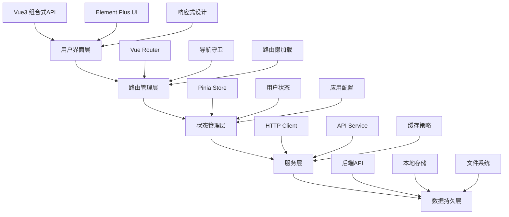
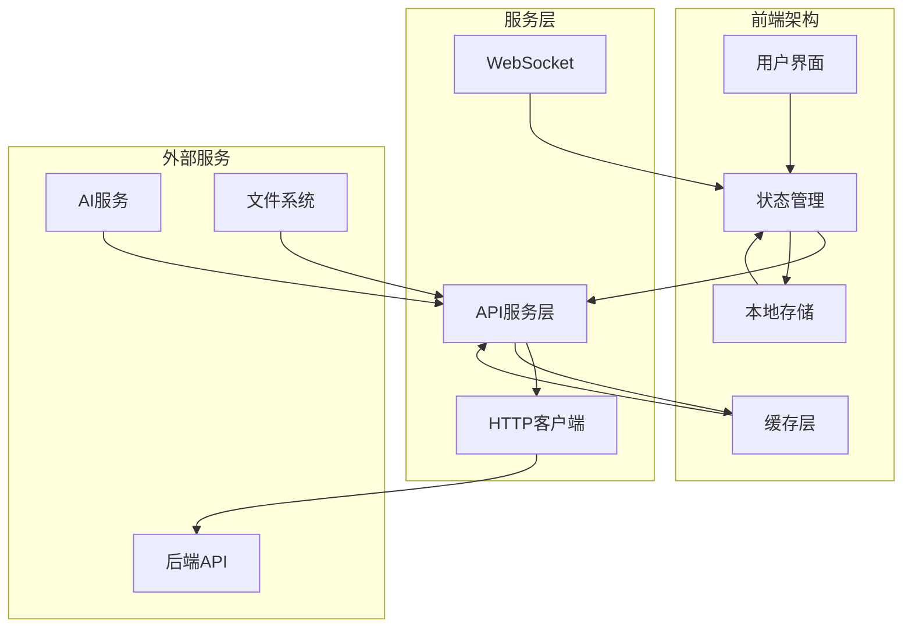

<div align="center">

# 🚀 鸿庆书云 - 智能创新协作平台


**✨ 云聚书，书载鸿，鸿成庆 ✨**

🎓 一个基于现代化技术栈构建的智能教育协作平台，融合AI驱动的项目匹配、知识管理、在线学习和团队协作功能，为学生和教育者提供全方位的创新支持

[🏠 快速开始](#-快速开始) · [🏗️ 项目架构](#-项目架构) · [🔧 开发指南](#️-开发环境配置) · [📖 API文档](#-api集成) · [🐛 问题反馈](https://github.com/1fantasy1/vue/issues)

</div>

---

## ✨ 平台概览

**鸿庆书云**是一个集成了人工智能技术的现代化教育协作平台，专为高等教育环境设计。平台通过智能算法实现精准的项目-学生匹配，结合丰富的学习资源和协作工具，为学生创新项目、学术研究和技能提升提供全方位支持。

### 🎯 核心价值主张

- **🤖 AI驱动匹配**：基于技能、兴趣和项目需求的智能推荐系统
- **📚 一站式学习**：从课程学习到项目实践的完整教育闭环
- **🌐 协作生态**：支持多人协作的项目管理和团队沟通
- **💡 知识沉淀**：结构化的知识库和笔记系统
- **🔧 跨平台支持**：Web和桌面应用双重体验

---

## 🌟 功能特性

<table>
<tr>
<td width="50%">

### 🎯 **智能项目管理**
- 🤖 **AI智能匹配**：基于算法的项目-学生匹配推荐
- 📊 **项目生命周期管理**：从创建到完成的全流程跟踪
- 👥 **团队协作工具**：申请审批、成员管理、进度同步
- 📈 **数据可视化**：项目统计和进度可视化展示
- 🏷️ **智能标签系统**：技能、角色、关键词多维度分类

### 📚 **在线学习系统**
- 📖 **丰富课程资源**：多学科、多层次的在线课程
- 📝 **智能笔记系统**：支持富文本、标记和分类的笔记管理
- 📊 **学习进度跟踪**：个性化的学习路径和进度监控
- 🎓 **完成度统计**：课程完成情况和学习成果展示
- 🔖 **收藏与书签**：便捷的内容收藏和快速访问

### �💬 **社交协作网络**
- 🌟 **创新广场**：发现热门项目和优秀创意
- 💬 **实时聊天室**：多人群聊和私人对话支持
- 👤 **个人主页**：展示个人项目、技能和成就
- ⭐ **收藏系统**：个性化的内容收藏和管理
- 🔍 **智能搜索**：全平台内容的快速检索

</td>
<td width="50%">

### 🧠 **知识管理中枢**
- 📖 **结构化知识库**：分层级的知识组织和管理
- 🏷️ **智能分类系统**：自动标签生成和内容分类
- 🔍 **全文搜索引擎**：高效的内容检索和知识发现
- 📎 **文档上传处理**：支持多格式文档的解析和存储
- 🔗 **知识关联**：智能的知识点关联和推荐

### 🛠️ **开发者工具**
- 🧪 **API测试工具**：内置的接口调试和测试工具
- 🔧 **系统配置管理**：灵活的功能开关和参数配置
- 📊 **性能监控面板**：系统状态和性能指标监控
- 🐛 **调试工具集**：开发调试和问题排查工具
- 🌍 **多环境支持**：开发、测试、生产环境配置

### 🎨 **用户体验**
- 🎭 **现代化UI设计**：基于Element Plus的美观界面
- 📱 **响应式布局**：适配桌面和移动设备
- 🌙 **主题切换**：支持明暗主题和个性化定制
- ⚡ **高性能体验**：基于Vite的快速构建和热更新
- 🔄 **实时数据同步**：前后端数据的实时同步更新

### 🤖 **AI集成功能**
- 🧠 **多模型支持**：集成OpenAI、DeepSeek、智谱等多个AI模型
- 💬 **智能对话**：基于大语言模型的智能问答系统
- 🔍 **语义搜索**：AI驱动的内容理解和推荐
- 📊 **数据分析**：智能的用户行为分析和洞察
- 🎯 **个性化推荐**：基于用户画像的精准内容推荐

</td>
</tr>
</table>

## 🏗️ 技术架构

<div align="center">

### 🎨 前端技术栈

| 技术栈 | 版本 | 描述 | 应用场景 |
|--------|------|------|----------|
|  | `v3.4.0` | 现代化的 JavaScript 框架 | 组合式API、响应式数据管理 |
|  | `v5.0.0` | 下一代前端构建工具 | 快速开发构建、热模块替换 |
|  | `v4.x` | 官方路由管理器 | SPA路由管理、导航守卫 |
|  | `v2.1.0` | 轻量级状态管理库 | 全局状态、用户认证管理 |
|  | `v2.4.0` | 企业级 UI 组件库 | 界面组件、表单验证 |
|  | `v1.11.0` | HTTP 客户端库 | API请求、拦截器处理 |
|  | `v30.0.0` | 跨平台桌面应用框架 | 桌面应用打包、本地功能 |

### 🛠️ 开发工具与集成

| 工具 | 版本 | 用途 | 配置 |
|------|------|------|------|
| **ESLint** | `latest` | 代码质量检查 | JavaScript/Vue代码规范 |
| **DOMPurify** | `v3.1.6` | HTML安全处理 | 防XSS攻击、内容净化 |
| **Marked** | `v12.0.2` | Markdown解析 | 文档渲染、笔记处理 |
| **Electron Builder** | `v24.13.3` | 应用打包工具 | 多平台桌面应用构建 |
| **Concurrently** | `v9.0.0` | 并行任务执行 | 开发环境多进程管理 |

### 🏗️ 系统架构设计



</div>

### 🌐 多平台支持

<table>
<tr>
<td width="33%">

#### 🌐 **Web应用**
- **开发服务器**：Vite Dev Server (5173端口)
- **生产构建**：静态资源优化和代码分割
- **PWA支持**：离线缓存和应用安装
- **响应式设计**：适配各种屏幕尺寸

</td>
<td width="33%">

#### 🖥️ **桌面应用**
- **Electron框架**：跨平台桌面应用
- **Windows**：NSIS安装包 + 便携版
- **自动更新**：内置更新检查机制
- **本地功能**：文件系统访问、系统集成

</td>
<td width="33%">

#### 🔧 **开发环境**
- **热模块替换**：开发时实时更新
- **代理配置**：后端API代理转发
- **环境变量**：多环境配置支持
- **调试工具**：集成开发者工具

</td>
</tr>
</table>

## 🚀 快速开始

### 📋 环境要求

<div align="center">

| 工具 | 版本要求 | 推荐版本 | 下载链接 |
|------|----------|----------|----------|
|  | `≥ 18.0.0` | `20.x LTS` | [nodejs.org](https://nodejs.org/) |
|  | `≥ 9.0.0` | `latest` | 随Node.js安装 |
|  | `latest` | `latest` | [git-scm.com](https://git-scm.com/) |

</div>

### 🔧 安装步骤

```bash
# 📥 1. 克隆项目
git clone https://github.com/1fantasy1/vue.git
cd vue

# 📦 2. 安装依赖
npm install

# ⚙️ 3. 环境配置（可选）
cp .env.example .env
# 编辑 .env 文件设置API地址等配置
```

### 🏃‍♂️ 运行项目

<table>
<tr>
<td width="50%">

#### 🔥 **Web开发模式**
```bash
# 启动开发服务器
npm run dev

# 🌐 访问地址
# http://localhost:5173
```

**功能特性：**
- ⚡ 热模块替换 (HMR)
- 🔄 API代理转发
- 🛠️ 开发者工具集成
- 📱 响应式设计预览

</td>
<td width="50%">

#### 🖥️ **桌面应用开发**
```bash
# 启动Electron开发模式
npm run electron:dev

# 📱 桌面应用体验
# 自动打开桌面应用窗口
```

**功能特性：**
- 🖼️ 原生窗口体验
- 📁 本地文件系统访问
- 🔔 系统通知支持
- 🎨 系统主题适配

</td>
</tr>
</table>

### �📦 生产构建

```bash
# 🌐 Web应用构建
npm run build

# 👀 预览构建结果
npm run preview

# 🖥️ 桌面应用打包
npm run build:app
# 生成的安装包位于 release/ 目录
```

### 🐳 容器化部署

```bash
# 构建Docker镜像
docker build -t hongqing-shuyun .

# 运行容器
docker run -p 8080:80 hongqing-shuyun
```

## 📁 项目结构

<div align="center">

### 🏗️ 完整目录架构

</div>

```
鸿庆书云/
├── 📄 index.html                # 应用入口HTML
├── ⚙️ jsconfig.json             # JavaScript配置
├── 📦 package.json              # 项目依赖与脚本
├── 📖 README.md                 # 项目文档
├── 🛠️ vite.config.js            # Vite构建配置
├── 🌍 .env                      # 环境变量配置
├── 🖥️ electron/                 # Electron桌面应用
│   ├── ⚡ main.cjs              # 主进程文件
│   └── 🔧 preload.cjs           # 预加载脚本
├── 🌍 public/                   # 公共静态资源
│   ├── 🎯 favicon.ico           # 网站图标
│   └── 📜 layout-test.js        # 布局测试脚本
├── 📦 release/                  # 应用发布包
│   ├── 🖥️ 鸿庆书云 1.0.0.exe    # Windows可执行文件
│   ├── 📦 鸿庆书云 Setup 1.0.0.exe # Windows安装程序
│   └── 📂 win-unpacked/         # Windows解包文件
└── 🎨 src/                      # Vue应用源码
    ├── 🏠 App.vue               # 根组件
    ├── 🚪 main.js               # 应用入口
    ├── 🎨 assets/               # 静态资源
    │   ├── 🎭 base.css          # 基础样式
    │   ├── 🖼️ logo.svg          # 项目Logo
    │   └── 💄 main.css          # 主样式文件
    ├── 🧩 components/           # 通用组件库
    │   ├── 🔧 APITestTool.vue   # API测试工具组件
    │   ├── ⭐ CollectButton.vue  # 收藏按钮组件
    │   ├── 📝 CollectionModal.vue # 收藏弹窗组件
    │   ├── 📚 CourseRecommendations.vue # 课程推荐组件
    │   ├── 🎉 HelloWorld.vue    # 示例组件
    │   ├── 🖼️ HtmlPreview.vue    # HTML预览组件
    │   ├── 🤖 LLMExampleComponent.vue # LLM示例组件
    │   ├── 📄 MaterialDetailModal.vue # 资料详情弹窗
    │   ├── 📚 MaterialManager.vue # 资料管理组件
    │   ├── 📝 NoteModal.vue     # 笔记弹窗组件
    │   ├── 🎯 ProjectApplications.vue # 项目申请组件
    │   ├── 📋 ProjectForm.vue   # 项目表单组件
    │   ├── 🎉 TheWelcome.vue    # 欢迎组件
    │   ├── 📋 WelcomeItem.vue   # 欢迎项组件
    │   ├── 🎭 icons/            # 图标组件集合
    │   └── ⚙️ settings/         # 设置相关组件
    ├── 🎪 composables/          # 组合式函数
    │   ├── 📡 useApiData.js     # API数据处理钩子
    │   ├── 🤖 useLLMConfig.js   # LLM配置管理钩子
    │   └── 💾 useLocalData.js   # 本地数据管理钩子
    ├── ⚙️ config/               # 应用配置
    │   └── 📝 index.js          # 主配置文件
    ├── 🛣️ router/               # 路由管理
    │   ├── 🎯 index.js          # 当前路由配置
    │   ├── 💾 index_backup.js   # 路由配置备份
    │   └── 🆕 index_new.js      # 新路由配置
    ├── 🔗 services/             # 服务层
    │   ├── 🌐 api.js            # 统一API接口
    │   ├── 💾 cache.js          # 缓存服务
    │   ├── 📡 httpClient.js     # HTTP客户端
    │   └── 🌍 remoteApi.js      # 远程API服务
    ├── 🗃️ stores/               # 状态管理 (Pinia)
    │   └── 🌍 global.js         # 全局状态管理
    ├── 🔧 utils/                # 工具函数库
    └── 📱 views/                # 页面视图组件
        ├── 🏠 Home.vue          # 首页
        ├── 🌟 Plaza.vue         # 广场页面
        ├── 👤 Profile.vue       # 个人中心
        ├── 🔐 Login.vue         # 登录页面
        ├── 🎯 MyProjects.vue    # 我的项目
        ├── 📚 MyCourses.vue     # 我的课程
        ├── ⭐ Favorites.vue     # 收藏夹
        ├── 📖 KnowledgeBase.vue # 知识库
        ├── 🧠 KnowledgeHub.vue  # 知识中心
        ├── � ChatRooms.vue     # 聊天室
        ├── 📝 CourseNotes.vue   # 课程笔记
        ├── ⚡ QuickNotes.vue    # 快速笔记
        ├── 🛠️ DevTools.vue      # 开发工具
        ├── 🧪 APITest.vue       # API测试页面
        ├── 📊 ProjectDetail.vue # 项目详情
        ├── 📚 CourseDetail.vue  # 课程详情
        ├── 📑 DocumentDetail.vue # 文档详情
        ├── 🏢 AllProjects.vue   # 所有项目
        ├── 🎓 CourseBrowser.vue # 课程浏览
        ├── 🎛️ CourseManagement.vue # 课程管理
        ├── ⭐ CollectionDetail.vue # 收藏详情
        ├── 🎯 ProjectRecommendations.vue # 项目推荐
        └── 📝 CourseNotes_new.vue # 新版课程笔记
```

### 🏗️ 架构说明

<table>
<tr>
<td width="50%">

#### 🎨 **前端架构**
- **组件化设计**：可复用的Vue组件
- **状态管理**：Pinia集中式状态管理
- **路由管理**：Vue Router声明式路由
- **样式系统**：Element Plus + 自定义CSS
- **工具函数**：抽象的通用工具和钩子

#### 🔗 **服务层设计**
- **API抽象**：统一的接口调用封装
- **缓存策略**：本地缓存和远程数据同步
- **错误处理**：全局错误捕获和处理
- **拦截器**：请求/响应的统一处理

</td>
<td width="50%">

#### ⚙️ **配置管理**
- **环境变量**：多环境配置支持
- **功能开关**：模块化的功能控制
- **API配置**：灵活的后端接口配置
- **构建配置**：Vite优化的构建设置

#### 🖥️ **跨平台支持**
- **Web应用**：现代浏览器支持
- **桌面应用**：Electron跨平台方案
- **响应式设计**：移动端适配
- **PWA支持**：离线访问能力

</td>
</tr>
</table>

## 🔧 开发环境配置

## 🔧 开发环境配置

<div align="center">

### 💻 推荐的IDE设置

</div>

| IDE | 插件 | 说明 | 配置 |
|-----|------|------|------|
|  | [Volar](https://marketplace.visualstudio.com/items?itemName=Vue.volar) | Vue 3 语言支持 | 替代Vetur插件 |
|  | [ESLint](https://marketplace.visualstudio.com/items?itemName=dbaeumer.vscode-eslint) | 代码质量检查 | 自动修复和格式化 |
|  | [Prettier](https://marketplace.visualstudio.com/items?itemName=esbenp.prettier-vscode) | 代码格式化 | 统一代码风格 |

<div align="center">

### 🛠️ 项目扩展配置

</div>

项目已配置推荐扩展，VS Code会自动提示安装：

```json
{
  "recommendations": [
    "Vue.volar",
    "dbaeumer.vscode-eslint",
    "esbenp.prettier-vscode",
    "bradlc.vscode-tailwindcss"
  ]
}
```

<div align="center">

### 🌍 环境变量配置

</div>

项目支持多环境配置，创建相应环境文件：

| 文件 | 环境 | 用途 | 示例配置 |
|------|------|------|----------|
| `.env` | 通用 | 所有环境通用配置 | `VITE_APP_TITLE=鸿庆书云` |
| `.env.development` | 开发 | 开发环境专用配置 | `VITE_API_BASE_URL=http://localhost:8001` |
| `.env.production` | 生产 | 生产环境专用配置 | `VITE_API_BASE_URL=https://api.hongqing.com` |
| `.env.local` | 本地 | 本地开发个人配置 | 不会被git跟踪 |

### ⚙️ 核心环境变量

```bash
# API配置
VITE_API_BASE_URL=http://localhost:8000    # 后端API地址
VITE_WS_BASE_URL=ws://localhost:8000/ws    # WebSocket地址

# 应用配置
VITE_APP_NAME=鸿庆书云                      # 应用名称
VITE_APP_VERSION=1.0.0                     # 应用版本
VITE_APP_DESCRIPTION=智能创新协作平台        # 应用描述

# 功能开关
VITE_ENABLE_RAG=true                       # 启用RAG功能
VITE_ENABLE_RECOMMENDATION=true            # 启用推荐系统
VITE_ENABLE_SEARCH=true                    # 启用搜索功能
VITE_ENABLE_AI_CHAT=true                   # 启用AI聊天

# 文件上传配置
VITE_MAX_FILE_SIZE=10485760               # 最大文件大小(10MB)
VITE_SUPPORTED_FILE_TYPES=.txt,.pdf,.doc,.docx  # 支持的文件类型

# 开发配置
VITE_DEV_TOOLS=true                       # 开发工具
VITE_DEBUG_MODE=true                      # 调试模式
```

## 📱 功能模块详解

<div align="center">

### 🎯 核心功能模块

</div>

<table>
<tr>
<td width="33%">

#### 🏠 **首页 (Home)**
- 📊 **数据概览**：项目和课程统计展示
- 🚀 **快速导航**：功能模块快速入口
- 📈 **个人统计**：学习进度和项目参与情况
- 🔔 **通知中心**：重要消息和更新提醒

#### 🌟 **广场 (Plaza)**
- 🔍 **智能搜索**：基于技能和兴趣的项目发现
- 🔥 **热门推荐**：算法驱动的热门项目展示
- 💬 **社区互动**：项目讨论和创意分享
- 🏷️ **标签筛选**：多维度的项目分类和筛选

#### 👤 **个人中心 (Profile)**
- 🛠️ **信息管理**：个人资料和技能标签
- ⚙️ **系统设置**：个性化偏好和通知设置
- 🤖 **AI配置**：LLM模型和MCP服务器管理
- 📊 **数据统计**：个人学习和项目数据分析

</td>
<td width="33%">

#### 📊 **项目管理**
- ➕ **项目创建**：灵活的项目发布和配置
- 📈 **进度跟踪**：可视化的项目进度管理
- 👥 **团队协作**：成员管理和权限控制
- 🎯 **智能匹配**：AI驱动的学生-项目匹配
- 📋 **申请处理**：项目申请的审核和管理

#### 📚 **学习系统**
- 📖 **课程浏览**：丰富的在线课程资源
- 📊 **学习跟踪**：个性化的学习进度管理
- 📝 **笔记系统**：富文本笔记和标签管理
- 🔖 **收藏功能**：课程和资源的便捷收藏
- 🏆 **成就系统**：学习成果的可视化展示

#### 💬 **沟通协作**
- ⚡ **实时聊天**：团队和项目组的即时通讯
- 📎 **文件共享**：项目文档和资源的协作管理
- 🤔 **消息通知**：重要事件的及时提醒
- 📧 **邮件集成**：与外部邮件系统的无缝对接

</td>
<td width="33%">

#### 📖 **知识管理**
- 🏗️ **知识库**：结构化的知识组织和管理
- 🏷️ **智能分类**：自动标签和分类系统
- 🔍 **全文搜索**：高效的内容检索和发现
- 📎 **文档处理**：多格式文档的上传和解析
- 🔗 **知识关联**：智能的内容关联和推荐

#### 🔧 **开发者工具**
- 🧪 **API测试**：内置的接口调试和测试工具
- 🐛 **调试面板**：系统状态和错误监控
- 📊 **性能监控**：应用性能和用户行为分析
- ⚙️ **配置管理**：系统参数和功能开关
- 🔒 **权限管理**：用户角色和访问控制

#### 🤖 **AI集成**
- 🧠 **多模型支持**：OpenAI、DeepSeek、智谱等
- 💬 **智能对话**：基于大语言模型的问答
- 🎯 **个性化推荐**：用户行为分析和内容推荐
- 🔍 **语义搜索**：AI驱动的内容理解和匹配
- 🛠️ **MCP集成**：Model Context Protocol服务器管理

</td>
</tr>
</table>

### 🔄 数据流架构



## ⚙️ API集成

<div align="center">

### 🔗 后端API架构

</div>

项目采用前后端分离架构，支持灵活的API配置和多环境部署。

### 🌐 API配置系统

<table>
<tr>
<td width="50%">

#### 🔧 **开发环境配置**
```javascript
// vite.config.js - 开发代理
export default {
  server: {
    proxy: {
      '/api': {
        target: 'http://127.0.0.1:8001',
        changeOrigin: true,
        secure: false,
        rewrite: (path) => path.replace(/^\/api/, '')
      }
    }
  }
}
```

**特性：**
- 🔄 热重载代理转发
- 🛠️ 跨域问题解决
- 📊 请求日志记录
- ⚡ 快速开发调试

</td>
<td width="50%">

#### 🌍 **生产环境配置**
```bash
# .env.production
VITE_API_BASE_URL=https://api.hongqing.com
VITE_WS_BASE_URL=wss://api.hongqing.com/ws
VITE_CDN_BASE_URL=https://cdn.hongqing.com
```

**特性：**
- 🔒 HTTPS安全连接
- 🌍 CDN资源加速
- 📈 负载均衡支持
- 🛡️ 安全策略集成

</td>
</tr>
</table>

### 🔗 API服务层架构

```javascript
// 统一API服务封装
export class ApiService {
  // 项目管理API
  static async getProjects(filters) { /* ... */ }
  static async createProject(data) { /* ... */ }
  static async updateProject(id, data) { /* ... */ }
  
  // 课程学习API  
  static async getCourses(params) { /* ... */ }
  static async getCourseDetail(id) { /* ... */ }
  static async submitNote(courseId, note) { /* ... */ }
  
  // 用户管理API
  static async login(credentials) { /* ... */ }
  static async getProfile() { /* ... */ }
  static async updateProfile(data) { /* ... */ }
  
  // AI集成API
  static async chatWithAI(message, context) { /* ... */ }
  static async getRecommendations(type, params) { /* ... */ }
}
```

### 📊 API功能模块

| 模块 | 端点 | 功能 | 认证 |
|------|------|------|------|
| **用户管理** | `/users/*` | 注册、登录、资料管理 | 🔓/🔒 |
| **项目管理** | `/projects/*` | 项目CRUD、申请、匹配 | 🔒 |
| **课程系统** | `/courses/*` | 课程浏览、学习记录 | 🔒 |
| **知识库** | `/knowledge/*` | 文档管理、搜索 | 🔒 |
| **聊天系统** | `/chat/*` | 消息发送、群组管理 | 🔒 |
| **文件管理** | `/files/*` | 上传、下载、预览 | 🔒 |
| **AI服务** | `/ai/*` | 对话、推荐、分析 | 🔒 |
| **MCP集成** | `/mcp/*` | MCP服务器管理 | 🔒 |

### 🛠️ 高级特性

<table>
<tr>
<td width="50%">

#### ⚡ **性能优化**
- 📦 **请求缓存**：智能缓存策略减少重复请求
- 🔄 **分页加载**：大数据集的分页和懒加载
- 📊 **数据压缩**：响应数据的gzip压缩
- ⏱️ **超时控制**：灵活的请求超时配置

#### 🔒 **安全机制**
- 🎫 **JWT认证**：无状态的用户认证
- 🛡️ **请求签名**：防篡改的请求验证
- 🚨 **错误处理**：统一的错误格式和处理
- 📝 **日志记录**：完整的API调用日志

</td>
<td width="50%">

#### 🌐 **实时通信**
- 📡 **WebSocket**：实时消息和状态同步
- 🔄 **自动重连**：网络断开的自动恢复
- 💬 **消息队列**：可靠的消息传递机制
- 📊 **状态同步**：多客户端状态一致性

#### 🧪 **开发支持**
- 🔧 **Mock数据**：本地开发的模拟数据
- 📊 **API监控**：请求性能和错误监控
- 🐛 **调试工具**：内置的API调试界面
- 📖 **文档生成**：自动生成的API文档

</td>
</tr>
</table>

## 🤝 贡献指南

<div align="center">

### 🌟 欢迎每一位贡献者！

我们非常欢迎社区的贡献，无论是代码改进、文档完善、问题反馈还是功能建议。

</div>

### 🚀 快速开始贡献

<table>
<tr>
<td width="50%">

#### 📝 **代码贡献流程**

1. **🍴 Fork项目仓库**
   ```bash
   # 克隆你的fork
   git clone https://github.com/yourusername/vue.git
   cd vue
   ```

2. **🌿 创建功能分支**
   ```bash
   git checkout -b feature/amazing-feature
   ```

3. **💾 开发和提交**
   ```bash
   # 遵循代码规范开发
   npm run dev
   
   # 提交代码
   git add .
   git commit -m "feat: add amazing feature"
   ```

4. **📤 推送和PR**
   ```bash
   git push origin feature/amazing-feature
   # 在GitHub上创建Pull Request
   ```

</td>
<td width="50%">

#### 📋 **代码规范要求**

- **🏷️ 命名规范**
  - 组件名：`PascalCase` (如: `ProjectCard.vue`)
  - 文件名：`kebab-case` (如: `project-detail.vue`)
  - 函数名：`camelCase` (如: `getUserProfile`)
  - 常量：`UPPER_SNAKE_CASE` (如: `API_BASE_URL`)

- **📝 提交信息规范**
  ```bash
  feat: 新功能
  fix: 修复问题
  docs: 文档更新
  style: 代码格式调整
  refactor: 代码重构
  test: 测试相关
  chore: 构建过程或辅助工具变动
  ```

- **🔧 代码质量**
  - 运行 ESLint 检查：`npm run lint`
  - 遵循 Vue 3 组合式 API 规范
  - 保持代码简洁和可读性
  - 添加必要的注释和文档

</td>
</tr>
</table>

### 📊 贡献类型

<table>
<tr>
<td width="25%">

#### 💻 **代码贡献**
- 🐛 修复已知Bug
- ✨ 添加新功能
- ⚡ 性能优化
- 🎨 UI/UX改进
- 🔧 工具和配置

</td>
<td width="25%">

#### 📖 **文档贡献**
- 📚 API文档完善
- 🔧 安装指南更新
- 🎓 教程和示例
- 🌍 多语言翻译
- 📋 规范标准化

</td>
<td width="25%">

#### 🧪 **测试贡献**
- 🔍 单元测试编写
- 🌐 集成测试完善
- 📱 兼容性测试
- 📊 性能测试基准
- 🐛 Bug复现和验证

</td>
<td width="25%">

#### 💡 **社区贡献**
- 🤔 问题反馈
- 💭 功能建议
- 🏷️ 标签整理
- 🎯 需求分析
- 📢 推广宣传

</td>
</tr>
</table>

### 🛠️ 开发环境设置

```bash
# 1. 环境准备
node --version  # 需要 >= 18.0.0
npm --version   # 需要 >= 9.0.0

# 2. 安装依赖
npm install

# 3. 启动开发服务器
npm run dev

# 4. 代码检查
npm run lint

# 5. 构建测试
npm run build
```

### 🎯 贡献重点领域

| 优先级 | 领域 | 描述 | 技能要求 |
|--------|------|------|----------|
| 🔥 **高** | AI功能优化 | 智能推荐算法改进 | Python, 机器学习 |
| 🔥 **高** | 性能优化 | 前端性能和用户体验 | Vue.js, 性能分析 |
| 🔥 **高** | 移动端适配 | 响应式设计完善 | CSS, 移动端开发 |
| 🔶 **中** | 测试覆盖 | 单元和集成测试 | Jest, Vue Test Utils |
| 🔶 **中** | 国际化 | 多语言支持 | i18n, 翻译 |
| 🔵 **低** | 文档完善 | 开发文档和教程 | 技术写作 |

### 📞 沟通渠道

- **💬 讨论区**：[GitHub Discussions](https://github.com/1fantasy1/vue/discussions)
- **🐛 问题报告**：[GitHub Issues](https://github.com/1fantasy1/vue/issues)
- **📧 邮件联系**：fantasy@example.com
- **💬 即时通讯**：项目内聊天室功能

## 📝 版本历史与路线图

<div align="center">

### 🚀 版本发布时间线

</div>

<table>
<tr>
<td width="50%">

#### 🎉 **v1.0.0** `2025-08-09` ✅

**🌟 重大里程碑 - 正式发布**

**✨ 核心功能**
- 🚀 完整的项目管理系统
- 🤖 AI驱动的智能匹配算法
- 📚 在线课程学习平台
- 💬 实时聊天和协作功能
- 📖 结构化知识库系统

**🔧 技术成就**
- 🏗️ 前后端分离架构
- 📱 Electron桌面应用支持
- 🎨 现代化UI/UX设计
- ⚡ 高性能前端构建
- 🛠️ 完善的开发工具链

**📊 数据指标**
- 📁 50+ 文件代码库
- 🧩 30+ Vue组件
- 🔗 20+ API接口
- 📱 支持Web + 桌面双平台

</td>
<td width="50%">

#### 🌱 **v0.0.0** `2025-08-04` ✅

**🎊 项目启动 - 基础搭建**

**🏗️ 基础架构**
- 📦 Vue 3 + Vite 项目初始化
- 🎨 Element Plus UI库集成
- 🗂️ Pinia状态管理配置
- 🛣️ Vue Router路由系统
- 🔧 开发环境配置

**🎯 初始功能**
- 🔐 用户登录系统
- 🏠 基础页面框架
- 📝 项目结构设计
- 🎨 UI组件开发
- 📖 文档编写

**📈 技术债务**
- 🚀 确定技术栈选型
- � 制定开发规范
- 🏗️ 建立项目架构
- 🔄 设置CI/CD流程

</td>
</tr>
</table>

<div align="center">

### 📈 发展路线图

</div>

<table>
<tr>
<td width="25%">

#### 🔥 **v1.1.0** `计划中`
**预计发布**: 2025-09-01

**🎯 主要特性**
- 🔐 完整的用户认证系统
- 🌐 第三方登录集成 (微信、QQ)
- 📧 邮件通知系统
- 🔔 实时消息推送

**🛠️ 技术改进**
- 🚀 性能优化和代码分割
- 📱 移动端适配优化
- 🧪 单元测试覆盖
- 📊 用户行为分析

</td>
<td width="25%">

#### 🌟 **v1.2.0** `规划中`
**预计发布**: 2025-10-01

**🤖 AI功能增强**
- 🧠 多模型AI对话系统
- 🎯 个性化推荐算法
- 🔍 智能语义搜索
- 📊 数据挖掘和分析

**🎨 用户体验**
- 🌙 深色主题支持
- 🎭 自定义主题系统
- ⚡ 离线功能支持
- 📱 PWA应用支持

</td>
<td width="25%">

#### 🚀 **v1.3.0** `展望`
**预计发布**: 2025-11-01

**🌐 扩展功能**
- 🗃️ 数据导入导出
- 🔗 API开放平台
- 🏗️ 插件系统架构
- 🌍 国际化多语言

**🏢 企业级特性**
- 👥 多租户支持
- 🔒 高级权限管理
- 📈 数据可视化大屏
- 🔐 安全审计日志

</td>
<td width="25%">

#### 🎯 **v2.0.0** `愿景`
**预计发布**: 2025-12-01

**🎮 下一代体验**
- 🥽 VR/AR界面支持
- 🎮 游戏化学习体验
- 🤖 AI助手个性化
- 🌊 流式数据处理

**🏗️ 架构升级**
- ☁️ 云原生部署
- 🔄 微服务架构
- 📊 大数据平台集成
- 🚀 边缘计算支持

</td>
</tr>
</table>

### 📊 技术演进计划

<table>
<tr>
<td width="50%">

#### 🔧 **技术栈升级路径**

**前端技术**
- 📦 Vue 3.5+ (Composition API深度应用)
- ⚡ Vite 6.0 (构建性能优化)
- 🎨 Tailwind CSS (原子化CSS)
- 📱 Capacitor (移动端混合开发)

**开发工具**
- 🧪 Vitest (现代化测试框架)
- 📊 Storybook (组件文档和测试)
- 🔍 TypeScript (类型安全增强)
- 🛠️ Turborepo (单仓库管理)

</td>
<td width="50%">

#### 🎯 **功能演进目标**

**智能化水平**
- 🤖 更准确的项目匹配算法
- 🧠 更智能的学习路径推荐
- 📊 更精准的用户画像分析
- 🎯 更个性化的内容推送

**平台生态**
- 🔌 第三方集成能力
- 🌍 开放API生态
- 👥 社区插件市场
- 🏢 企业级定制方案

</td>
</tr>
</table>

### 🎮 贡献机会

我们欢迎社区参与到以下版本的开发中：

- 🔥 **即刻参与**：v1.1.0 用户认证系统开发
- 🌟 **提前规划**：v1.2.0 AI功能设计讨论
- 🚀 **长期合作**：v2.0.0 架构设计和技术选型

[💬 加入讨论](https://github.com/1fantasy1/vue/discussions) | [🐛 报告问题](https://github.com/1fantasy1/vue/issues) | [🔀 提交PR](https://github.com/1fantasy1/vue/pulls)

## 📄 许可证与法律信息

<div align="center">


本项目采用 **MIT 许可证** - 查看 [LICENSE](LICENSE) 文件了解详情

**开源自由，商业友好，欢迎任何形式的使用和贡献**

</div>

### 📋 许可证详情

**MIT License** 授权您：
- ✅ **商业使用**：可用于商业项目
- ✅ **修改代码**：可自由修改源代码
- ✅ **分发代码**：可重新分发
- ✅ **私人使用**：可用于个人项目
- ✅ **专利使用**：包含专利授权

**但需要：**
- 📄 保留版权声明
- 📋 包含许可证副本

**不承担：**
- 🚫 任何形式的责任和担保

---

## 👥 团队与致谢

<div align="center">

### 🌟 核心开发团队

<table>
<tr>
<td align="center" width="200px">
<br />
<sub><b>Fantasy</b></sub><br />
<sub>项目创始人 & 首席开发</sub><br />
<a href="https://github.com/1fantasy1" title="GitHub">💻</a>
<a href="#design-1fantasy1" title="设计">🎨</a>
<a href="#docs-1fantasy1" title="文档">📖</a>
<a href="#maintenance-1fantasy1" title="维护">🔧</a>
</td>
<td align="center" width="400px">

**贡献领域**
- 🏗️ 系统架构设计
- 💻 核心功能开发  
- 🎨 UI/UX设计
- 📖 技术文档编写
- 🔧 项目维护管理

**技术专长**
- Vue.js / JavaScript
- Node.js / Python
- 系统设计与架构
- AI/ML集成应用

</td>
</tr>
</table>

### 🤝 贡献者统计

[](https://github.com/1fantasy1/vue/graphs/contributors)

**感谢所有贡献者的付出！** ❤️

[查看完整贡献者列表](https://github.com/1fantasy1/vue/contributors)

</div>

### 🏆 特别致谢

<table>
<tr>
<td width="50%">

#### 💡 **技术支持**
- **Vue.js 团队** - 现代化前端框架
- **Element Plus** - 优秀的UI组件库  
- **Vite 团队** - 快速的构建工具
- **Pinia 团队** - 轻量级状态管理

#### 🎨 **设计灵感**
- **Modern UI Libraries** - 设计参考
- **Open Source Community** - 开源精神
- **User Experience Patterns** - 用户体验设计
- **Accessibility Guidelines** - 无障碍设计规范

</td>
<td width="50%">

#### 🤖 **AI技术支持**
- **OpenAI** - GPT模型技术支持
- **DeepSeek** - 深度学习算法
- **智谱AI** - 中文语言模型
- **SiliconFlow** - AI推理服务

#### 🌍 **社区支持**
- **GitHub Community** - 代码托管平台
- **Stack Overflow** - 技术问题解答
- **Vue.js Community** - Vue生态支持
- **开源社区** - 知识分享与交流

</td>
</tr>
</table>

### 📈 项目统计

<div align="center">


  


</div>

---

## 📞 联系与支持

<div align="center">

### 🤝 多渠道沟通，随时为您服务

</div>

<table>
<tr>
<td align="center" width="25%">

#### 💬 **社区讨论**
[](https://github.com/1fantasy1/vue/discussions)

**适用场景**
- 💡 功能建议和创意分享
- 🤔 技术问题讨论
- 📚 使用经验交流
- 🎯 发展方向探讨

</td>
<td align="center" width="25%">

#### 🐛 **问题反馈**
[](https://github.com/1fantasy1/vue/issues)

**适用场景**
- 🔧 Bug报告和复现
- 🚀 功能请求提交
- 📋 改进建议
- 🎯 优先级投票

</td>
<td align="center" width="25%">

#### 📧 **邮件联系**
[](mailto:fantasy@example.com)

**适用场景**
- 🤝 商务合作洽谈
- 🔒 安全问题报告
- 📄 法律和许可问题
- 🎓 学术研究合作

</td>
<td align="center" width="25%">

#### 💼 **企业服务**
[](mailto:enterprise@example.com)

**适用场景**
- 🏢 企业级定制开发
- ☁️ 私有化部署支持
- 🔧 技术咨询服务
- 📊 数据迁移协助

</td>
</tr>
</table>

### 📱 实时沟通

<table>
<tr>
<td width="50%">

#### 💬 **即时消息**
- **项目内聊天室**：使用应用内的聊天功能
- **开发者群组**：加入技术交流群
- **社区频道**：关注项目动态更新

#### 📞 **在线会议**
- **技术分享会**：定期的技术交流会议
- **用户反馈会**：收集用户意见和建议
- **开发规划会**：参与产品规划讨论

</td>
<td width="50%">

#### 🌐 **社交媒体**
- **GitHub**：关注项目更新
- **技术博客**：深度技术文章
- **开发日志**：开发进展分享

#### 📚 **文档支持**
- **Wiki文档**：详细的使用指南
- **API文档**：完整的接口说明
- **视频教程**：操作演示和讲解

</td>
</tr>
</table>

### 🚀 快速响应承诺

| 问题类型 | 响应时间 | 处理周期 | 优先级 |
|----------|----------|----------|--------|
| 🚨 **安全漏洞** | < 2小时 | 24小时内修复 | 🔴 最高 |
| 🐛 **严重Bug** | < 4小时 | 48小时内修复 | 🟠 高 |
| 💡 **功能请求** | < 24小时 | 1-2周评估 | 🟡 中 |
| 📝 **文档问题** | < 12小时 | 3-5天修复 | 🟢 低 |
| 🤔 **使用咨询** | < 8小时 | 当天回复 | 🔵 普通 |

### 💖 支持项目发展

<div align="center">

#### 🌟 如果这个项目对您有帮助，请给我们一个 Star ⭐

**您的支持是我们持续改进的动力！**

[](https://star-history.com/#1fantasy1/vue&Date)

</div>

**其他支持方式：**
- 🔀 **Fork项目**：参与代码贡献
- 📢 **推荐分享**：向朋友推荐项目
- 📝 **撰写教程**：分享使用经验
- 🐛 **反馈问题**：帮助改进产品质量
- 💡 **提出建议**：参与产品规划讨论

---

<div align="center">

### ✨ 感谢您选择鸿庆书云 ✨

**� 让我们一起构建更好的智能教育协作平台！**

<sub>Built with ❤️ using Vue 3 + Vite + Element Plus + Electron</sub>

---

*© 2025 鸿庆书云. All rights reserved.*

**🌟 云聚书，书载鸿，鸿成庆 🌟**

</div>
